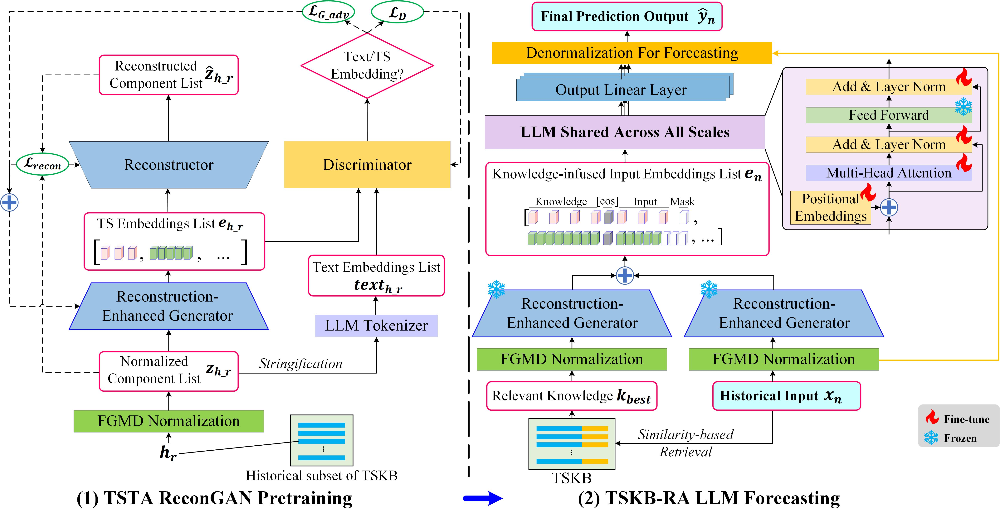

# A$^2$RA-NSMTSllm: Adversarially Aligning Retrieval-Augmented LLMs for Non-Stationary Multivariate Time Series Forecasting

## Overview

**A$^2$RA-NSMTSllm** is a novel framework that enhances LLMs for **non-stationary multivariate time series forecasting**, addressing multi-scale distribution shifts, modality gaps between time series and text, and limited domain-specific knowledge.

It consists of three key components:

- **Frequency-Guided Multi-scale Normalization–Denormalization Framework**  
  which handles non-stationarity by adaptively removing and restoring multi-scale distribution dynamics.

- **TS–Text Alignment ReconGAN**  
  which adversarially aligns time-series embeddings with the LLM semantic space while preserving temporal features.

- **TS Knowledge Base Retrieval Mechanism**  
  which dynamically adds supplementary knowledge to enhance forecasting performance.

Extensive experiments on six real-world benchmarks demonstrate that **A$^2$RA-NSMTSllm consistently outperforms recent state-of-the-art baselines**, including in **few-shot** and **zero-shot** forecasting scenarios.

  

## Requirements

The code requires the following Python packages:

- torch
- numpy
- pandas
- einops
- scikit-learn
- transformers
- peft
- accelerate
